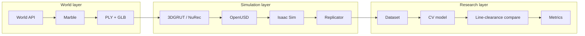

# PharmaVerse System Design and Research Plan

**Phase:** 1 — Research and Architecture  
**Status:** Complete for V1 / Experiment 01  
**Date:** 2026-09-14  
**Parent plan:** [`project_description.txt`](../project_description.txt)

This is the Phase 1 deliverable. It freezes the research questions, primary use case, architecture, object taxonomy, sensors, dataset schema, evaluation protocol, and Atlas adoption criteria so Phase 2 can generate worlds without re-litigating those choices.

PharmaVerse is a research prototype. It is **not** a validated GMP system.

---

## 1. Research questions

**Q1 — World models + simulation**

Can World Labs Marble generate pharmaceutical manufacturing worlds that NVIDIA Omniverse and Isaac Sim can turn into simulation-ready environments for synthetic inspection data and Physical AI research?

**Q2 — Sim2Real**

Can computer vision models trained primarily or partially on that synthetic data generalize to real-world imagery?

**V1 hypotheses**

| ID | Hypothesis | How we will know |
| --- | --- | --- |
| H1 | A Marble packaging-suite world can be exported (PLY splat + GLB collider) and imported into Isaac Sim as a navigable, collision-aware scene. | Phase 3–4: aligned USD stage with working physics. |
| H2 | Spawnable USD residuals on that world can be auto-labeled by Isaac Sim Replicator. | Phase 5: COCO dataset with non-empty boxes/masks. |
| H3 | A detector trained only on those labels can find residuals in held-out synthetic scenes, including occlusion and lighting variants. | Phase 8: per-level mAP and scene-level discrepancy recall. |
| H4 | Synthetic pretraining reduces the real images needed for comparable real-world performance. | Phase 9: Models A vs B vs C on one real test set. |

H1–H3 are in scope for the MVP. H4 is the major research finding and comes after the MVP.

---

## 2. Primary use case

**Experiment 01: Synthetic pharmaceutical line clearance.**

A packaging area has a known **CLEAR** expected state: no detection-class objects in the inspection zones. The simulator then spawns residuals (previous-product bottle, loose label, carton, tool, document, and similar). Virtual cameras observe the scene. A detector reports objects. PharmaVerse compares observed vs expected and emits **REVIEW REQUIRED** when they differ.

That use case is small enough to finish and strict enough to measure:

- The simulator owns ground truth.
- Success is not “the room looks real.” Success is **detect the residual, miss it, or false-alarm**.
- The same loop later supports Sim2Real and Physical AI.

Later experiments (product inspection, PPE, material tracking, autonomous patrol, multi-camera fusion) reuse the same world/sim/data/model split. They are out of scope until Experiment 01 works.

### Non-goals for V1

- Validated GMP, 21 CFR Part 11, or qualified manufacturing software
- World Labs Atlas as a runtime dependency
- A full factory or multiple rooms
- Baked Marble objects as the detection targets
- Robot navigation
- Tablet/vial defect inspection
- Real-time production deployment

---

## 3. Architecture

Marble generates the world. Isaac Sim makes it controllable. PharmaVerse orchestrates research.

```text
World Labs Marble / World API
        ↓
PLY Gaussian splats + GLB collider mesh
        ↓
NVIDIA 3DGRUT / Omniverse NuRec → USD/USDZ
        ↓
Isaac Sim stage
  world prims + spawnable USD residuals + cameras + semantics
        ↓
Isaac Sim Replicator
  RGB, boxes, masks, depth, camera params, scene metadata
        ↓
Detection / segmentation model
        ↓
Expected-state comparison → REVIEW REQUIRED | CLEAR
        ↓
Evaluation  (synthetic now, Sim2Real later)
```



This is the Lightwheel / NVIDIA pattern applied to pharmaceutical packaging: Marble world → splat → NuRec USD → Isaac Sim → sensors/tasks → evaluation.

### Responsibility split

| Layer | Owns | Does not own |
| --- | --- | --- |
| **Marble / World API** | Spatial layout, appearance, splat/mesh export, world variants | Exact physics, semantic labels, spawnable residuals, calibrated cameras |
| **OpenUSD / Isaac Sim** | Stage structure, collisions, lighting, cameras, SimReady/USD objects, Replicator labels | World-scale generative appearance |
| **PharmaVerse** | Prompts, taxonomy, scenarios, training, metrics, expected-state logic | Being a GMP system of record |

**Hard rule:** inspection targets are **USD prims spawned in Isaac Sim**, not objects that happen to be painted into the Marble splat. If Marble bakes bottles into the room, treat them as background clutter or edit/hide that region. Otherwise labels and visuals will disagree.

---

## 4. Marble / World API integration

Phase 2 implements this interface. Phase 1 only locks it.

### Access

- Product UI: [marble.worldlabs.ai](https://marble.worldlabs.ai/)
- API: `https://api.worldlabs.ai`
- Auth header: `WLT-Api-Key`
- Keys and **API credits** come from [platform.worldlabs.ai](https://platform.worldlabs.ai/). Marble app credits cannot be used with the API.
- Store the key in `.env` (`WLT_API_KEY`). Never commit it.

### V1 generate path

1. Iterate prompts in the Marble UI and/or with `marble-1.0-draft` (cheap).
2. Generate keepers with `marble-1.1` via `POST /marble/v1/worlds:generate`.
3. Poll `GET /marble/v1/operations/{operation_id}` until `done`.
4. Read `GET /marble/v1/worlds/{world_id}` for assets.
5. Export PLY: `POST /marble/v1/worlds/{world_id}:export` with `{"asset_type":"splats","format":"ply","resolution":"full_res"}`.
6. Download collider GLB from `assets.mesh.collider_mesh_url`.
7. Write metadata: `world_id`, model, seed, prompt id, operation ids, export URLs.

Optional later: image, panorama, multi-image, video, or Chisel layouts. V1 starts from **text**.

Use `marble-1.1-plus` only if `marble-1.1` worlds are too small for a packaging cell.

Recipe file: [`config/marble/packaging_suite_v1.yaml`](../config/marble/packaging_suite_v1.yaml).

### Export and coordinates

| Asset | Format | Role |
| --- | --- | --- |
| Gaussian splats | PLY (full res) | Visual world in Isaac Sim via NuRec |
| Collider mesh | GLB | Coarse physics / occupancy |
| High-quality mesh | GLB | Optional; slow and rate-limited; not required for V1 |

Marble worlds use an OpenCV-style frame (**+x left, +y down, +z forward**). Isaac Sim / many DCC tools expect OpenGL-style axes. Convert before simulation (scale Y and Z by −1, and/or rotate the GLB as in NVIDIA’s Marble tutorial, typically X = −90° on the collider).

NVIDIA’s documented conversion:

```text
python -m threedgrut.export.scripts.ply_to_usd scene.ply --output_file scene.usdz
```

Then unzip/import USDZ, align to a ground plane, scale to meters, parent the collider under the Gaussian volume, enable collision, hide collider rendering.

### World-level variation

Phase 2 produces a **small family**, not one hero scene: primary prompt × a few seeds, plus the variant prompts in the recipe. Phase 6 expands that set.

---

## 5. Simulation requirements

**Runtime:** Isaac Sim 5.1+ or 6.x, whichever we first validate for NuRec Gaussian USDZ import. Prefer 6.x once that path is confirmed.

**Stage composition (logical USD tree)**

```text
/World
  /World/Marble                    # splat volume + collider, meters, aligned to floor
  /World/GroundPlane               # shadow receiver / floor collider
  /World/Lights                    # dome + area lights (randomized later)
  /World/Zones                     # invisible volumes for line-clearance regions
  /World/Equipment                 # optional SimReady extras (guards, tables)
  /World/Residuals                 # spawnable detection-class prims
  /World/Cameras/cam_overhead
  /World/Cameras/cam_angled
```

**Physics:** collider mesh + ground plane. Residuals get rigid-body colliders so they rest on belts/tables instead of floating.

**Semantics:** every residual prim gets `class` = taxonomy `usd_semantic`. Environment prims get environment class labels. Replicator annotators read those labels.

**Expected state:** a CLEAR scene is `/World/Residuals` empty (or all residuals disabled). A discrepancy scene enables one or more residuals in a named zone.

**Scale check:** a 1 m reference cube and known object sizes from [`config/taxonomy.yaml`](../config/taxonomy.yaml) (`typical_size_m`). Packaging rooms should feel human-scale, not dollhouse or arena.

---

## 6. Object taxonomy

Canonical file: [`config/taxonomy.yaml`](../config/taxonomy.yaml).

**Detection classes (10)** — spawnable, labeled, counted as residuals if present in a CLEAR zone:

`bottle` · `vial` · `carton` · `label` · `cap` · `tray` · `tool` · `document` · `unidentified_container` · `packaging_component`

**Environment classes** — structure, not V1 residuals:

`conveyor` · `packaging_station` · `inspection_station` · `staging_area` · `bin` · `pallet` · `floor` · `wall` · `equipment`

**Zones**

`packaging_station_01` · `conveyor_infeed` · `conveyor_exit` · `inspection_station_01` · `material_staging`

**V1 clearance rule:** expected state is CLEAR. Any detection-class instance in a zone is a discrepancy. There is no “allowed bottle on the line” in Experiment 01. That keeps labels and logic simple.

Do not add classes until Experiment 01 has a baseline. Taxonomy drift before the first model wastes the dataset.

---

## 7. Sensors

Canonical file: [`config/cameras.yaml`](../config/cameras.yaml).

| ID | Role | Resolution | FOV | View |
| --- | --- | --- | --- | --- |
| `cam_overhead` | Coverage | 1920×1080 | 70° H | Down on station + conveyor |
| `cam_angled` | Inspection | 1920×1080 | 55° H | 35–45° onto conveyor exit |

Both cameras write RGB, depth, tight 2D boxes, semantic + instance masks, camera parameters, and occlusion. The V1 model trains on RGB + 2D boxes. Masks and depth are collected so we can switch to segmentation or debug without recapturing.

No LiDAR, stereo, or robot cameras in V1.

Placement test: a `bottle` at the back of the zone must still occupy at least ~20 pixels. If not, lower the camera or tighten FOV.

---

## 8. Dataset requirements

### Volume

| Split | Target | Source |
| --- | --- | --- |
| Synthetic train | ~5,600 | 70% of 8,000 |
| Synthetic val | ~1,200 | 15% |
| Synthetic test | ~1,200 | 15% |
| Real test | small, later | Phase 9 only |

8,000 labeled frames is the working target (inside the 5k–10k MVP band). Count **frames**, not worlds. Each scene is captured by both cameras when the residual is in view.

### Balance (synthetic train, approximate)

- 15% CLEAR (no residuals) — needed for false-alarm measurement
- 70% single residual
- 15% two or more residuals / clutter

Spread residuals across the 10 classes and 5 difficulty levels. Do not let `carton` dominate because it is easy to see.

### On-disk layout

```text
synthetic_data/
  v1/
    raw/                     # Replicator BasicWriter dump
    coco/                    # CocoWriter or converted COCO
      images/
      annotations.json
    metadata/
      frames.jsonl           # one JSON object per frame
    splits.json
```

`frames.jsonl` fields (minimum):

```json
{
  "frame_id": "000123",
  "world_id": "dc2c65e4-68d3-4210-a01e-7a54cc9ded2a",
  "prompt_id": "packaging_suite_v1",
  "model": "marble-1.1",
  "seed": 2,
  "camera_id": "cam_angled",
  "zone_id": "conveyor_exit",
  "expected_state": "CLEAR",
  "difficulty": 3,
  "residuals": [{"class": "label", "occlusion": 0.45}],
  "lighting": "warm_dim",
  "split": "train"
}
```

### Annotation stack

Isaac Sim Replicator:

- `BasicWriter` for RGB, depth, masks, boxes, camera params, occlusion
- `CocoWriter` for detection training interchange

V1 training format: **COCO detection**. YOLO export is optional and derived from COCO.

Ignore detections smaller than 16 px area at train and eval (`config/evaluation.yaml`).

---

## 9. Domain randomization

Two layers. Do not skip the world layer or the model will overfit one Marble room.

**World layer (Marble / World API)**  
Prompt phrasing, seed, optional Chisel layout. Produces digital cousins of a packaging suite.

**Simulation layer (Isaac Sim / Replicator)**

| Axis | V1 range |
| --- | --- |
| Residual class | 10 detection classes |
| Count | 0, 1, 2+ |
| Pose | On belt, table, floor, equipment edge |
| Occlusion | 0–80% |
| Scale | ±10% of `typical_size_m` |
| Lighting | Intensity, color temperature, dome rotation |
| Camera | Small pose jitter around the two mounts (±5 cm, ±5°) |
| Materials | Residual albedo / roughness, not the baked splat |

Difficulty levels 1–5 in [`config/evaluation.yaml`](../config/evaluation.yaml) are scenario presets over this space, not separate codepaths.

---

## 10. Line-clearance protocol

For every captured frame:

1. Known `expected_state` (V1: CLEAR).
2. Known `residuals[]` from the spawn list.
3. Model outputs `observed[]` (class, box, confidence).
4. Keep observations with confidence ≥ 0.50 and area ≥ 16 px.
5. If `observed` is non-empty → **REVIEW REQUIRED**, else **CLEAR**.
6. Scene-level correctness: flag when residual present; stay quiet when CLEAR.
7. Object-level correctness: predicted box IoU ≥ 0.50 with a spawned residual of the same class.

Example report (MVP):

```text
PHARMAVERSE INSPECTION
Area: Packaging Station 01
Expected state: CLEAR
Potential discrepancy detected
Object: carton
Zone: conveyor_exit
Confidence: 96.8%
Action: REVIEW REQUIRED
```

Human review is the product action. Auto-disposition of a real batch is out of scope.

---

## 11. Model and evaluation

**V1 model:** a single-stage detector (YOLO11 or equivalent) trained on synthetic COCO. Instance segmentation is optional once boxes work.

**Why detection first:** line clearance is “is an unexpected object in this zone?” Boxes are enough to highlight the finding. Segmentation can wait.

**Metrics:** [`config/evaluation.yaml`](../config/evaluation.yaml).

Report both:

- **Detector quality** — mAP@0.50, mAP@0.50:0.95, precision, recall, F1, per-class AP, latency p50/p95
- **Inspection quality** — discrepancy recall/precision, CLEAR specificity, missed-residual rate

A high mAP with poor CLEAR specificity still fails the use case (alarm fatigue). A model that always predicts CLEAR fails the other way.

**Phase 8 slices:** metrics overall and by difficulty 1–5, class, camera, and occlusion bin.

**Phase 9:** same real test set for Model A (real-only), B (synthetic-only), C (synthetic then real). Do not tune on that test set.

---

## 12. Software architecture

Target repository layout (filled across later phases):

```text
PharmaVerse/
  README.md
  project_description.txt
  docs/system-design.md          # this document
  config/
    taxonomy.yaml
    cameras.yaml
    evaluation.yaml
    marble/packaging_suite_v1.yaml
  src/pharmaverse/
    worlds/     # World API client, prompt runner, export, metadata
    usd/        # 3DGRUT/NuRec conversion helpers, stage composition
    sim/        # Isaac Sim scene, spawn residuals, Replicator
    inspect/    # expected vs observed
    train/      # detector training entrypoints
    eval/       # metrics and reports
  worlds/marble/{prompts,exports,metadata}/
  worlds/usd/
  synthetic_data/
  models/
  experiments/
  evaluation/
```

Package boundaries:

| Package | Phase | Job |
| --- | --- | --- |
| `pharmaverse.worlds` | 2 | Talk to Marble; persist recipe outputs |
| `pharmaverse.usd` | 3 | Splat/mesh → aligned USD |
| `pharmaverse.sim` | 4–6 | Isaac scene, cameras, Replicator |
| `pharmaverse.inspect` | 7–8 | CLEAR vs REVIEW REQUIRED |
| `pharmaverse.train` / `eval` | 7–9 | Fit and score models |

No command-center UI until Phase 10. CLI + dataset folders + metric JSON are enough through the MVP.

---

## 13. Atlas adoption criteria

Atlas is **not** in V1. Adopt it only when **all** of the following are true:

1. World Labs has granted product or partner access, or Atlas ships inside Marble.
2. Atlas can emit or update worlds we can still land in OpenUSD / Isaac Sim (splat, mesh, or equivalent).
3. A side-by-side on the packaging-suite recipe shows a clear gain on at least one of: geometric consistency, reconstruction from real photos, camera-controllable views, or Sim2Real gap.
4. The Phase 2–4 handoff (export → NuRec → Isaac) does not have to be thrown away.

Until then, every design assumes Marble + World API as the world layer.

---

## 14. Risks and constraints

| Risk | Mitigation |
| --- | --- |
| Splat looks right, physics/labels do not | Collider + spawnable USD residuals; never trust baked splat objects |
| Axis/scale mismatch | 1 m cube, taxonomy sizes, NVIDIA X = −90° collider note |
| Marble export requires a paid plan / API credits | Budget platform credits before Phase 2; keep draft model for prompt iteration |
| Isaac Sim / NuRec version skew | Pin the first working Isaac + 3DGRUT pair in `worlds/usd/README` during Phase 3 |
| Domain gap (splat pharma vs real plant) | World-level variants + residual randomization; Sim2Real is an experiment, not a promise |
| Class imbalance | Dataset mix in §8; per-class AP in eval |
| Over-building the factory | One room, two cameras, ten classes until Experiment 01 reports numbers |

---

## 15. Open questions (do not block Phase 2)

These can be answered with the first Marble exports. They must not reopen taxonomy or use case.

1. Is `marble-1.1` large enough for a packaging cell, or do we need `marble-1.1-plus`?
2. Does Chisel help more than prompt iteration for conveyor-line structure?
3. Which residual meshes do we buy/build vs. primitive stand-ins for the first 1,000 frames?
4. Isaac Sim 5.1 vs 6.x for NuRec USDZ — pick whichever imports cleanly.
5. Where will the first legally usable real images come from for Phase 9?

---

## 16. Phase 1 exit criteria

Phase 1 is done when all of the following are in the repo:

- [x] Research questions and hypotheses written
- [x] Primary use case locked (synthetic line clearance)
- [x] Marble vs Isaac Sim vs PharmaVerse split written
- [x] World API generate/export path specified
- [x] Simulation stage contract specified
- [x] Object taxonomy v1 frozen (`config/taxonomy.yaml`)
- [x] Camera spec frozen (`config/cameras.yaml`)
- [x] Dataset schema and volume specified
- [x] Evaluation protocol frozen (`config/evaluation.yaml`)
- [x] Atlas adoption criteria written
- [x] Phase 2 prompt recipe written (`config/marble/packaging_suite_v1.yaml`)

**Next:** Phase 2 — generate `packaging_suite_v1` with Marble / World API and store splat, collider, and metadata.

---

## 17. Sources

- [Marble: A Multimodal World Model](https://www.worldlabs.ai/blog/marble-world-model)
- [World API](https://docs.worldlabs.ai/api)
- [World API models](https://docs.worldlabs.ai/api/models)
- [Marble export specs](https://docs.worldlabs.ai/marble/export/specs.md)
- [Lightwheel × World Labs](https://www.worldlabs.ai/case-studies/2-lightwheel)
- [NVIDIA: Isaac Sim + Marble](https://developer.nvidia.com/blog/simulate-robotic-environments-faster-with-nvidia-isaac-sim-and-world-labs-marble/)
- [Isaac Sim Replicator SDG](https://docs.isaacsim.omniverse.nvidia.com/6.0.0/replicator_tutorials/tutorial_replicator_sdg_workflows.html)
- [Atlas](https://www.worldlabs.ai/blog/atlas)
